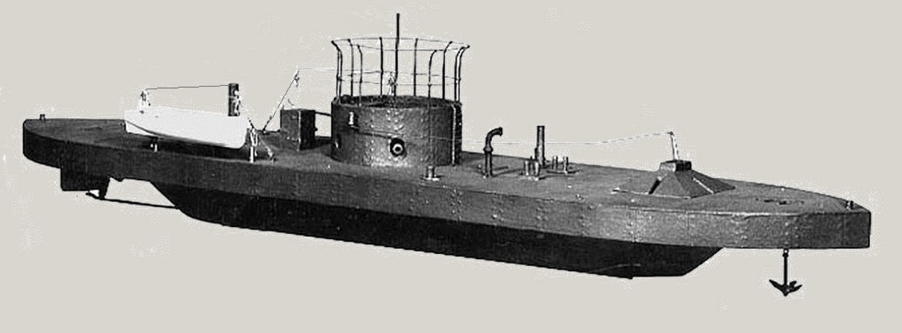

 
<h3 align=center>USS Monitor</h2>
<h4 align=center>Union warship in the first <a href="https://en.wikipedia.org/wiki/Ironclad_warship">ironclad-on-ironclad battle</a>.</h3>
 

#  Union Ships During the Civil War

## Introduction

This repo contains some work I have been doing on gathering a list of ships used by the Union during the US Civil War. This work was motivated by a discussion I heard on the Union Navy by [Drachinifel](https://www.youtube.com/watch?v=3tqD11AO1Iw). I was surprised to learn that the US Navy during the Civil War was so large. Drach commented that it was primarily a river navy with relatively little blue water capability. I decided to put together a list of the Union ships and some characteristics that would allow me to assess its capabilities.

## Background

### Vessel Types

<dl>
<dt>Blockade Operations</dt>
<dd>I created this category out the various <a href="https://en.wikipedia.org/wiki/Ship_of_the_line">ships of the line</a>, <a href="https://en.wikipedia.org/wiki/Sloop-of-war">sloops</a>, and <a href="https://en.wikipedia.org/wiki/Schooner">schooners</a> that were used to enforce the blockade. These were generally large sailing vessels that were suitable for ocean operation.</dd>
<dt>Gunboat</dt>
<dd>A gunboat is a naval watercraft designed for the express purpose of carrying one or more guns to bombard coastal targets (<a href="https://en.wikipedia.org/wiki/Gunboat">Wikipedia</a>). In the Civil War, these ships were often commercial vessels purchased by the Union and that mounted a small number of cannons.</dd>
<dt>Monitor</dt>
<dd>A monitor is a relatively small warship which is neither fast nor strongly armored but carries disproportionately large guns (<a href="https://en.wikipedia.org/wiki/Monitor_(warship)">Wikipedia</a>).
<dt>Obstacle</dt>
<dd>A number of boats were acquired to sink as obstacles in channels. For more information on these ships, see <a href="https://en.wikipedia.org/wiki/Stone_Fleet">stone fleet</a>.</dd>
<dt>Tender</dt>
<dd>A ship's tender, usually referred to as a tender, is a boat, or a larger ship, used to service or support other boats or ships. This is generally done by transporting people or supplies to and from shore or another ship (<a href="https://en.wikipedia.org/wiki/Ship%27s_tender">Wikipedia</a>).</dd>
<dt>Torpedo Boat</dt>
<dd>These were small boats that were fitted with <a href="https://en.wikipedia.org/wiki/Spar_torpedo">spar torpedoes</a>.</dd>
<dt>Transport</dt>
<dd>Vessel used for transporting military goods.</dd>
<dt>Tug</dt>
<dd>A tugboat or tug is a marine vessel that manoeuvres other vessels by pushing or pulling them, with direct contact or a tow line (<a href="https://en.wikipedia.org/wiki/Tugboat">Wikipedia</a>).</dd>
</dl>

There were 7 one-of-a-kind vessels that I lumped into the miscellaneous category.

* Balloon Barge A barge used to launch surveillance balloons.
* Lighthouse Tender A ship used to supply lighthouses.
* Minesweeper A ship used to sweep mines from waterways.
* Patrol A ship used for waterway surveillance.
* Pilot Boat A boat used to transfer harbor/river pilots for navigating through difficult waterways.
* Reconnaissance A former survey ship that was used to perform detailed charting of unmapped areas.
* Submarine An early submarine that sank while being towed.

### Data Sources

#### Data Dictionary

### Data Collection

### Format

## Analysis

### Number Ships By Category

**Name**|**Count**
:-----:|:-----:
Gunboat|435
Transport|96
Blockade Operations|57
Tug|55
Obstacle|45
Monitor|29
Tender |10
Torpedo Boat |5
Miscellaneous |7

### Tonnage of Ships By Category

**Role**|**Tonnage (1000 tonne)**
:-----:|:-----:
Gunboat|250
Blockade Operations|93
Transport|66
Monitor|45
Obstacle|13
Tug|9
Torpedo Boat|4
Balloon Barge|2
Other|3
Tender|1
Total|483

### Ships By Propulsion

**Role**|**Count**
:-----:|:-----:
Steam|535
Sail|171
Steam, Sail|31
Towed|1
Hand Cranked|1
Total|739
